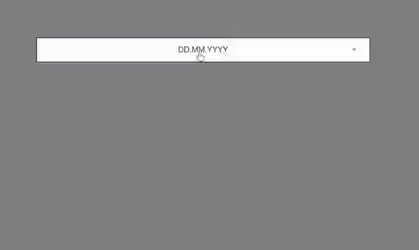

# [vue-dateselect](https://github.com/GabrielBuragev/vue-date-select)

## Jump on the github link to check out the demo :)



`
npm install vue-date-select
`

Usage
```javascript
<template>
    ...
    <DateSelect></DateSelect>
    ...
</template>
<script>
import DateSelect from 'vue-date-select'
export default {
    // ...
    components: {
        DateSelect
    }
}
</script>
```
#### or in main.js
```javascript
// ... 
import { DateSelect } from "vue-date-select";
Vue.component('DateSelect', DateSelect);
// ...
```
---
## :Props

##### v-model - The component will give back an Object containing "day","month","year" properties

##### :dateFormat - String specifying the format of the displayed date and the order of the dropdown lists in the date-select. 

###### Example:
```
:dateFormat="dd.mm.yyyy"
:dateFormat="mm-dd-yyyy" 
...
Any combination of "mm", "dd", "yyyy" separated by any of the 
following characters ".","-"," ".
```
###### Default value:

```
"dd.mm.yyyy"
```
##### :yearRange - Array of two elements where the first element is the beggining and the second element is the end of the year range.
###### Example: 
```javascript
:yearRange="[1900, 2019]"
```
###### Default value: 
```javascript
[1900, new Date().getFullYear()]
```

##### :startDay, :startMonth, :startYear - Number indicating at which element the drodown lists should be scrolled to at the beggining
###### Example:
```javascript
:startDay="6"
:startMonth="6"
:startYear="2000"
```
###### Default value: 
```javascript
:startDay="15"
:startMonth="6"
:startYear="1965"
```

##### :locale (experimental) - Language for the months dropdown, and hopefully in future masking of the label with corresponding letters. Currently supported ->  ["en_EN"," de_DE"]. 

###### Default value: "en_EN".

##### :dragscroll - Boolean indicating whether or not the dragscroll directive should be enabled on the dropdown lists.
###### Default value: true
---
#### @Events

##### @complete(dateObject) - Event fired when the date-select has a completed value.

